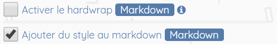

# FAQ

## Qu'est-ce que JdBEdit ?

JdBEdit est un IDE, un éditeur de code pour le HTML, le JavaScript, le CSS et le Markdown conçu pour aider les gens à apprendre, créer et partager le Web avec le Web. Vous avez votre code sur le côté gauche de l'écran et un aperçu de votre code sur le côté droit de la fenêtre. Lorsque vous modifiez votre code, vous devez l'exécuter pour apporter les modifications dans l'aperçu. De plus, JdBEdit regorge d’outils d’apprentissage pour vous aider à évoluer sans niveau de compétences.



## Comment créer un fichier ?

Pour créer un fichier, référez-vous à la page **Commencer**.



## Comment créer un compte ?

Il est utile de créer un compte ou de se connecter avant même de commencer votre premier projet, mais vous pouvez démarrer un projet et créer un compte ou vous connecter à tout moment.

Pour le moment, JdBEdit ne permet pas d'avoir un compte JdBEdit mais il utilise le service GitHub pour vous permettre de sauvegarder vos codes en ligne. Il suffit donc d'avoir ou de créer un compte GitHub et se connecter à JdBEdit avec votre compte GitHub ou avec un jeton d'accès à votre compte GitHub.

## Comment sauvegarder un fichier ?

JdBEdit n'enregistre pas automatiquement vos modifications lorsque vous apporterez des modifications au code. Il est donc nécessaire de sauvegarder votre code manuellement en enregistrant d'abord un brouillon puis la version finale.

Si vous sauvegardez votre code sur Gist GitHub, une fois le code en ligne, tout le monde peut trouver et  remixer \(dupliquer et modifier\) votre projet même s'il est privé \(une personne qui dispose de l'adresse de votre fichier peut y accéder - Les gists privés ne sont pas vraiment privés\). 

## Où sont stockées mes données ?

Dépendant de votre choix, vos fichiers peuvent-être sauvegardés sur votre navigateur en tant que brouillon ou en ligne, sur GitHub. Vous pouvez aussi télécharger vos fichiers dans vos documents.


Il est recommandé de stocker vos travaux en ligne pour vous assurer que les fichiers ne seront pas perdus si les données de votre navigateur sont effacées.


## JdBEdit peut-il accéder à mes données sans me le dire ?

JdBEdit est une application basée sur un navigateur. Les jetons d'accès émis par GitHub sont stockés sur votre navigateur et ne sont envoyés à aucun type de backend \(serveur\) ou de tierce partie afin que vos données ne soient accessibles à personne.

## Comment puis-je dupliquer un projet ou un fichier ?

Pour dupliquer un fichier gist, vous devez ouvrir le fichier en question sur JdBEdit et aller dans `Menu A` &gt; `Fichier` &gt; _Dupliquer_.


**Attention :** Vous ne pouvez pas dupliquer votre propre fichier. Mais il est désormais possible d'y arriver en ouvrant le projet à dupliquer en tant que modèle, puis l'enregistrer sur votre compte.


Si vous tenez absolument à dupliquer votre propre fichier, suivez la même procédure pour dupliquer et une notification sera affichée pour vous proposer une alternative de duplication qui s'agit d'ouvrir le fichier actuel en tant que modèle et de l'enregistrer \(manuellement\) en tant que nouveau fichier. Cliquez sur `Ouvrir en tant que modèle` dans la notification pour dupliquer.

## Comment prévisualiser mon projet ?

JdBEdit est fait avec une vue d'éditeur dans la fenêtre de gauche et un aperçu sur le côté droit. Lorsque vous apportez une modification dans votre éditeur et exécuterez le code, celui-ci sera mis à jour dans l'aperçu.

## Comment ajouter une image, un CSS ou un JavaScript externe ?

Pour le moment, un seul fichier est pris en charge. Pour utiliser le CSS et ou le JavaScript dans votre HTML, vous devez tous les mettre dans une seule page HTML, le CSS dans une balise `style` et le JavaScript dans une balise `script`.

## Je peux utiliser le markdown ?

Si vous créez des fichiers  _.markdown_ ou __ _.md_, JdBEdit créera automatiquement des fichiers HTML pour les accompagner, afin que le navigateur les rende. Pour créer un fichiers markdown, c'est simple, il suffit de nommer votre fichier ainsi : **mon fichier.md** ou **mon fichier.markdown**. 

Pour en savoir plus sur comment créer un fichier, rendez-vous sur :



Vous pouvez ajouter un style initial au rendu de votre markdown en cachant dans les Paramètre JdBEdit la case **Ajouter du style au markdown** comme illustré ci-après :

## Comment supprimer les cookies ?

Vous pouvez supprimer les cookies relatives à JdBEdit directement sur JdBEdit. Aller dans `Paramètres` &gt; `Réinitialiser` &gt; un panneau  s'ouvre &gt; Sélectionnez vos paramètres puis cliquez sur `CONFIRMER ET RÉINITIALISER` &gt; vos cookies sont supprimer et la page va s'actualiser après quelques secondes.

## Où puis-je signaler des bogues

Signalez tous les bugs et suggérez des fonctionnalités dans le traqueur de bugs JdBEdit. Une description détaillée et un cas de test réduit sont appréciées. Merci pour vos efforts visant à améliorer JdBEdit !

