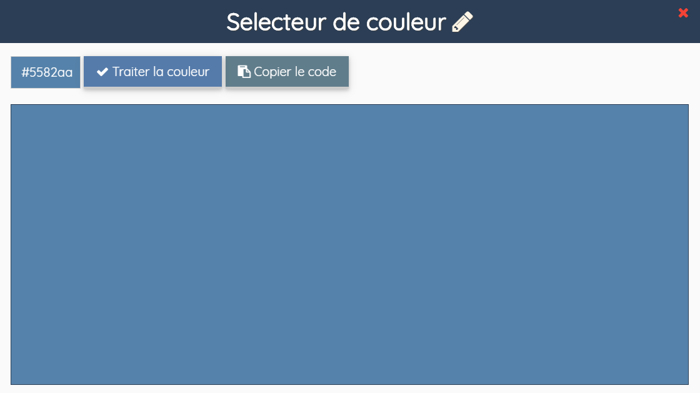

# Les panneaux

dBEdit affiche ses autres fonctionnalités dans ce que j'appelle **panneau**. Les panneaux sont accessibles via la barre de navigation et certains sont accessibles aussi via les raccourcis clavier.

## Les paramètres

Le panneau Paramètres JdBEdit contient les options de personnalisation de l'éditeur : thème, taille et famille de police, indentation, retrait, etc. Ces paramètres peuvent-être enregistrés. Dans ce cas, ils seront stockés dans des cookies et seront utilisables uniquement par le navigateur que vous avez utilisez pour les sauvegarder.

Un bouton **Sauvegarder** et **Réinitialiser** se trouvent fixés en bas du panneau.

## Ouvrir un fichier

Le panneau permettant d'ouvrir un fichier donne la possibilité d'ouvrir un Gist de [Gist GitHub](https://gist.github.com), d'importer un pen de [CodePen](https://codepen.io), 

## Selecteur de couleur

Choisissez des couleurs depuis l'éditeur. Le panneau Selecteur de couleur vous permet sélectionner une couleur sur un cadre d'arrière-plan unicolore.  Comment choisir une couleur si l'arrière-plan est unicolore ? C'est simple, survoler le cadre en question avec le curseur de votre souris et vous trouverez votre couleur par rapport aux coordonnées de votre curseur. Une fois la couleur trouvée, cliquez pour confirmer la selection et JdBEdit vous fournira un dégradé de 10 nuances de la couleur choisie et un thème  \(code\) CSS que vous pouvez copier pour ajouter à votre page.

## Les raccourcis clavier

Pour plus d'infos sur les raccourcis clavier et avoir une listes des combinaisons de touches, cliquez [ici](https://code.wetrafa.xyz/?modal=shortcuts). ou faites la combinaison de touches `Ctrl` + `Alt` + `K` directement sur JdBEdit.

