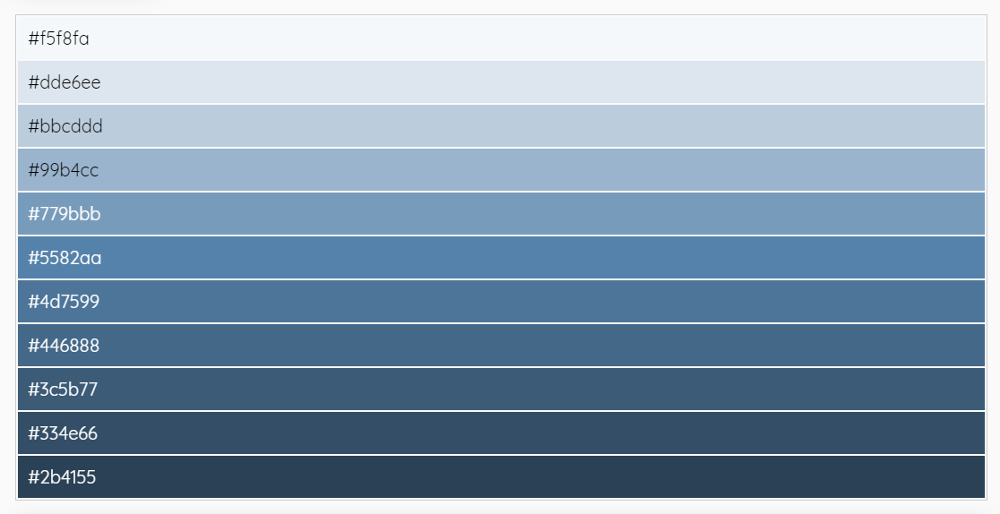

# Les panneaux

JdBEdit affiche ses autres fonctionnalités dans ce que j'appelle **panneau**. Les panneaux sont accessibles via la barre de navigation et certains sont accessibles aussi via les raccourcis clavier.

## Les paramètres

Le panneau Paramètres JdBEdit contient les options de personnalisation de l'éditeur : thème, taille et famille de police, indentation, retrait, etc. Ces paramètres peuvent-être enregistrés. Dans ce cas, ils seront stockés dans des cookies et seront utilisables uniquement par le navigateur que vous avez utilisez pour les sauvegarder.

Un bouton **Sauvegarder** et **Réinitialiser** se trouvent fixés en bas du panneau.

Accès : 

* Barre de navigation &gt; _Paramètres_
* `Menu A` &gt; `Options` &gt; _Paramètres_
* `Ctrl` + `Alt` + `S`

## Ouvrir un fichier

Le panneau permettant d'ouvrir un fichier donne la possibilité :

* d'ouvrir un Gist de [Gist GitHub](https://gist.github.com),
* d'importer un pen de [CodePen](https://codepen.io),
* d'importer un fichier local,
* d'exporter une copie de l'historique des gists manipulés,

Et contient aussi un tableau de cette historique.

Accès : 

* `Menu A` &gt; `Fichier` &gt; _Ouvrir_
* `Ctrl` + `Alt` + `O`

## Selecteur de couleur

Choisissez des couleurs depuis l'éditeur.


Le panneau Selecteur de couleur vous permet sélectionner une couleur sur un cadre d'arrière-plan unicolore.  Comment choisir une couleur si l'arrière-plan est unicolore ? C'est simple, survoler le cadre en question \(_grand cadre bleu dans l'illustration ci-dessus, cp 1_\) avec le curseur de votre souris et vous trouverez votre couleur par rapport aux coordonnées de votre curseur.

Une fois la couleur trouvée, cliquez pour confirmer la selection et JdBEdit vous fournira un dégradé de 10 nuances de la couleur choisie \(_illustration ci-après, cp 2_\) - et un thème CSS que vous pouvez copier pour ajouter à votre page.




```css
.theme-l5 {color:#000 !important; background-color:#f5f8fa !important}
.theme-l4 {color:#000 !important; background-color:#dde6ee !important}
.theme-l3 {color:#000 !important; background-color:#bbcddd !important}
.theme-l2 {color:#000 !important; background-color:#99b4cc !important}
.theme-l1 {color:#fff !important; background-color:#779bbb !important}
.theme-d1 {color:#fff !important; background-color:#4d7599 !important}
.theme-d2 {color:#fff !important; background-color:#446888 !important}
.theme-d3 {color:#fff !important; background-color:#3c5b77 !important}
.theme-d4 {color:#fff !important; background-color:#334e66 !important}
.theme-d5 {color:#fff !important; background-color:#2b4155 !important}
.theme-light {color:#000 !important; background-color:#f5f8fa !important}
.theme-dark {color:#fff !important; background-color:#2b4155 !important}
.theme-action {color:#fff !important; background-color:#2b4155 !important}
.theme, .hover-theme:hover {color:#fff !important; background-color:#5582aa !important}
.text-theme, .hover-text-theme:hover {color:#5582aa !important}
.border-theme, .hover-border-theme:hover {border-color:#5582aa !important}
```


Accès : `Menu A` &gt; `Options` &gt; `Outils` &gt; _Sélecteur de couleur_

## Les raccourcis clavier

Pour plus d'infos sur les raccourcis clavier et avoir une listes des combinaisons de touches, cliquez [ici](https://code.wetrafa.xyz/?modal=shortcuts) ou faites la combinaison de touches `Ctrl` + `Alt` + `K` directement sur JdBEdit.

## Enregistrer votre code

Ce panneau donne simplement la possibilité de sauvegarder votre fichier en ligne. Une fois le fichier sauvegardé, ce même panneau contiendra les information à propos du fichier.

## Extraits de code

Ce panneau contient quelques extraits de code HTML, CSS et JavaScript faites à l'avance pour vous au cas où vous ne vous souviendrez plus de comment inclure une vidéo dans votre page ou encore si vous souhaitez ajouter un formulaire de contact sans devoir tout écrire par exemple.

Pour insérer un extrait de code JdBEdit à votre code, mettez le curseur à la position où voulez insérer l'extrait &gt; ouvrez le panneau Extraits de code &gt; choisissez le code à insérer &gt; cliquez sur le nom de l'extrait pour voir le code et le bouton d'insertion &gt; cliquez sur le bouton **Insérer** pour insérer le code à la position du curseur.

Accès : `Menu A` &gt; `Édition` &gt; _Ajouter un extrait de code_

## 

## Partager

Ce panneau contient des options de partage de votre fichier. Vous pouvez y obtenir :

* un lien du mode édition du fichier \(on peu voir le code - personnalisable\),
* un lien du mode production \(on a juste le résultat du code - personnalisable\),
* des boutons pour les réseaux sociaux et email,
* un lien raccourci,

## 

