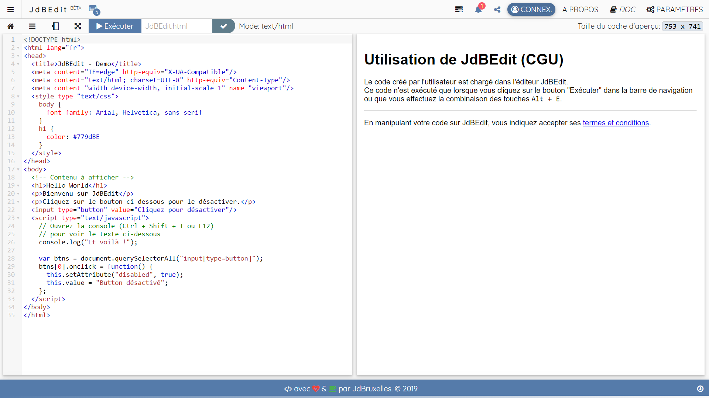

# Qu'est-ce-que JdBEdit

## Introduction

> Créé en 2017, JdBEdit ou JdBEditor est un simple éditeur de code en ligne développée à l'aide du langage de programmation JavaScript. L'application web est utilisable sur des plateformes web telle qu'un navigateur internet.

JdBEdit est un IDE en ligne, un éditeur de code pour le HTML, le JavaScript, le CSS, le Markdown et le texte brut. Il est conçu pour aider les gens à apprendre, créer et partager le Web avec le Web. Vous avez votre code sur le côté gauche de l'écran et un aperçu de votre code sur le côté droit. Lorsque vous modifiez votre code, vous devez l'exécuter pour appliquer les modifications apportées dans l'aperçu. De plus, JdBEdit regorge d’outils d’apprentissage pour vous aider à évoluer sans niveau de compétences.


[José dBruxelles](https://w.we-rl.xyz/br-cd) est le créateur, le mainteneur et manager de JdBEdit.


## Fonctionnalités

1. Près de 30 thèmes d'éditeur colorés,
2. Prévisualisation du code,
3. Exécution automatique ou manuelle du code :
   * Par défaut, JdBEdit n'exécute pas votre code automatiquement. Il faut cliquer sur le bouton `Exécuter` sur la barre de navigation ou faire la combinaison des touches `Alt` + `E` sont les seuls moyens pour mettre à jour l'aperçu de votre code.
   * L'activation de l'aperçu automatique se fait dans les paramètres de l'éditeur. Une fois l'option activée, votre code sera exécuté et aperçu \(si le fichier est en langage HTML ou Markdown\) toutes les 3 sec. après chaque fin de saisie.
4. Auto-complétion lors de la saisie,
5. Extraits de codes pratiques,
6. Mise en correspondance de balises,
7. Des paramètres complètement personnalisables,
8. Ligne actuelle surlignée,
9. Rechercher et remplacer \(tous\),
10. Saut à la ligne,
11. Sélection et édition multi-lignes :
    * JdBEdit prend en charge le traitement de texte avec plusieurs curseurs pour des modifications simultanées et rapides. Vous pouvez ajouter des curseurs secondaires avec la combinaison `Ctrl` + `Clic gauche`. Chaque curseur fonctionne indépendamment en fonction du contexte dans lequel il se trouve.
12. Fermeture automatique de crochets, accolades, etc.,
13. Fermeture automatique de balises,
14. Format de text personnalisable \(Ex.: "text/html". Adapte aussi la coloration du texte\),
15. Mode plein écran \(sans distraction\),
16. Compresseur de JavaScript,
17. Encodeur et décodeur d'URL,
18. Selecteur de couleur,
19. Console JavaScript
    * Et oui, JdBEdit a une console ! Comme une console native de navigateur, vous pouvez enregistrer \(faire noter\) des éléments du JavaScript
20. Mise en forme du code,JdBEdit a un excellent support pour le formatage de votre code source. L'éditeur a deux types de mise en forme :

    * **Mise en forme intégrale** \(Ctrl + Enter\) - Met en en forme tout le document.
    * **Mise en forme de la selection** \(Alt + T\) - Met en forme uniquement le code sélectionné.

    Accessible via: `Menu A` &gt; `Options`

21. Code pliable,
22. Changement d'orientation via le button de rotation,
23. Ajout facile des bibliothèques JavaScript et CSS populaires,Vous pouvez ajouter des bibliothèques JavaScript ou CSS à votre fichier via le panneau de librairies paramètres. **Comment?** Cliquez sur le `Menu A` &gt; `Edition` &gt; _`Ajouter une ressource`_, cliquez ensuite sur le nom de la bibliothèque voulue pour ajouter dans votre code, à la position du curseur une balise `script` ou `link` le lien du fichier de la bibliothèque sélectionnée. Vous avez la possibilité de vous servir directement sur [CDNJS.com](https://cdnjs.com) à l'aide d'une simple recherche.
24. Utilisation de n'importe quelle police système \(8 polices pré-installées\),
25. Télécharger le code en format html, word, css, js, txt, md ou autres,
26. Enregistrer le code sur Gist GitHub,
27. Importer un fichier de Gist GitHub ou de l'ordinateur,
28. Dupliquer un fichier existant sur Gist GitHub,
29. Exporter un fichier sur CodePen,
30. Importer un pen de CodePen,
31. Possibilité de glisser et déposer un fichier texte: Éditez les fichiers d'un dossier local en les faisant glisser depuis le dossier source et en les déposant dans l'éditeur,
32. Prise en charge d'[Emmet](https://docs.emmet.io/),
33. Signaler un dysfonctionnement,

## Fonctionnalités à venir

* Intégrations d'autres moyens de stockage en ligne \(Ex.: Google Drive\),
* Collaboration en temps réel,
* Création de project à 3 fichier \(HTML, CSS, JS\),
* Thème sombre,

## Prérequis

Vous devez avoir des connaissances de base en HTML, CSS et/ou markdown et sur comment utiliser un éditeur de code,  tout simplement.

## Autres

JdBEdit prend en charge les langages web HTML, CSS, JavaScript et markdown en plus du texte brut. Java et Python sont récemment supportés mais ils ne sont pas encore exécutables. Cela dit : vous pouvez juste éditer votre code en bénéficiant de la surbrillance du texte. 

L'éditeur est complètement personnalisable via des paramètres. Il enregistre l'historique des fichier et permet la sauvegarde et l'exportation de cette historique.


JdBEdit n'est pas comparable  à Sublime Text, VS Code, Atom ou autre car il ne permet ni d'éditer plusieurs fichiers en même temps, ni un project de plusieurs fichiers, ni un fichier lourd. Il ne permet pas non plus d'ajouter des packages externes. Un seul fichier à la fois est éditable sur JdBEdit. **La possibilité d'éditer un projet de 3 fichiers \(HTML, CSS et JavaScript\) est envisagée pour les mois qui suivent.**


