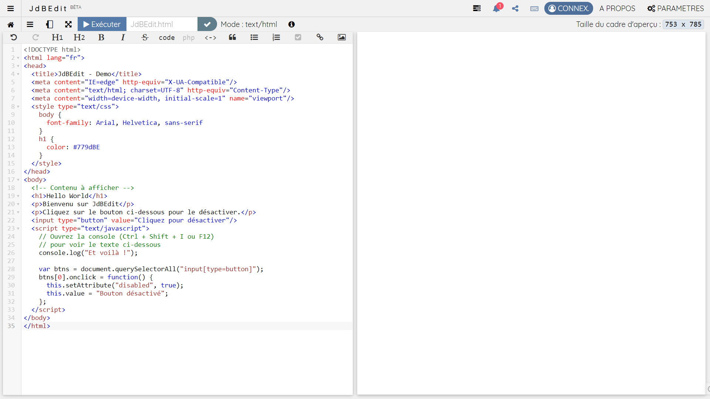

# Qu'est-ce-que JdBEdit

## Introduction

> Créé en 2017, JdBEdit ou JdBEditor est un simple éditeur de code en ligne développé à l'aide du langage de programmation JavaScript. L'application web est utilisable sur des plateformes web tel qu'un navigateur web.

JdBEdit est un IDE en ligne, un éditeur de code pour le HTML, JavaScript, CSS, Markdown, JSON, YAML, TOML et le texte brut. Il est conçu pour aider les gens à apprendre, créer et partager le Web avec le Web. Vous avez votre code sur le côté gauche de l'écran et un aperçu de votre code sur le côté droit. Lorsque vous modifiez votre code, vous devez l'exécuter pour appliquer les modifications apportées dans l'aperçu. De plus, JdBEdit regorge d’outils d’apprentissage pour vous aider à évoluer sans niveau de compétences.


[José dBruxelles](https://w.we-rl.xyz/br-cd) est le créateur et le mainteneur de JdBEdit.


## Aperçu \(Capture d'écran\)

## Fonctionnalités

1. Près de 30 thèmes d'éditeur colorés,
2. Prévisualisation du code,
3. Exécution automatique ou manuelle du code :
   * Par défaut, JdBEdit n'exécute pas votre code automatiquement. Il faut cliquer sur le bouton `Exécuter` sur la barre de navigation ou faire la combinaison des touches `Alt` + `E` sont les seuls moyens pour mettre à jour l'aperçu de votre code.
   * L'activation de l'aperçu automatique se fait dans les paramètres de l'éditeur. Une fois l'option activée, votre code sera exécuté et aperçu \(si le fichier est en langage HTML ou Markdown\) toutes les 3 sec. après chaque fin de saisie.
4. Auto-complétion lors de la saisie,
5. Extraits de codes pratiques,
6. Mise en correspondance de balises,
7. Des paramètres complètement personnalisables,
8. Ligne actuelle surlignée,
9. Rechercher et remplacer \(tous\),
10. Saut à la ligne,
11. Sélection et édition multi-lignes :
    * JdBEdit prend en charge le traitement de texte avec plusieurs curseurs pour des modifications simultanées et rapides. Vous pouvez ajouter des curseurs secondaires avec la combinaison `Ctrl` + `Clic gauche`. Chaque curseur fonctionne indépendamment en fonction du contexte dans lequel il se trouve.
12. Fermeture automatique de crochets, accolades, etc.,
13. Fermeture automatique de balises,
14. Format de texte personnalisable \(Ex.: "text/html". Adapte aussi la coloration du texte\),
15. Mode plein écran \(sans distraction\),
16. Compresseur de JavaScript,
17. Encodeur et décodeur d'URL,
18. Sélecteur de couleur,
19. Console JavaScript
    * Et oui, JdBEdit a une console ! Comme une console native de navigateur, vous pouvez enregistrer \(faire noter\) des éléments du JavaScript
20. Mise en forme du code : JdBEdit a un excellent support pour le formatage de votre code source. L'éditeur a deux types de mise en forme :

    * **Mise en forme intégrale** \(Ctrl + Enter\) - Met en en forme tout le document.
    * **Mise en forme de la sélection** \(Alt + T\) - Met en forme uniquement le code sélectionné.

    Accessible via: `Menu A` &gt; `Options`

21. Code pliable,
22. Changement d'orientation via le bouton de rotation,
23. Ajout facile des bibliothèques JavaScript et CSS populaires,Vous pouvez ajouter des bibliothèques JavaScript ou CSS à votre fichier via le panneau de librairies paramètres. **Comment?** Cliquez sur le `Menu A` &gt; `Edition` &gt; _`Ajouter une ressource`_, cliquez ensuite sur le nom de la bibliothèque voulue pour ajouter dans votre code, à la position du curseur une balise `script` ou `link` le lien du fichier de la bibliothèque sélectionnée. Vous avez la possibilité de vous servir directement sur [CDNJS.com](https://cdnjs.com) à l'aide d'une simple recherche.
24. Utilisation de n'importe quelle police système \(8 polices pré-installées\),
25. Télécharger le code en format html, word, css, js, txt, md ou autres,
26. Enregistrer le code sur Gist GitHub,
27. Importer un fichier de Gist GitHub ou de l'ordinateur,
28. Dupliquer un fichier existant sur Gist GitHub,
29. Exporter un fichier sur CodePen,
30. Importer un pen de CodePen,
31. Possibilité de glisser et déposer un fichier texte: Éditez les fichiers d'un dossier local en les faisant glisser depuis le dossier source et en les déposant dans l'éditeur,
32. Prise en charge d'[Emmet](https://docs.emmet.io/),
33. Signaler un dysfonctionnement,
34. Enregistrer des notes en local,
35. Créer un brouillon.

## Fonctionnalités à venir

* Intégrations d'autres moyens de stockage en ligne \(Ex.: Google Drive\),
* Mode collaboration en temps réel,
* Création de projet à 3 fichier \(HTML, CSS, JS\),
* Thème sombre.

## Prérequis

Vous devez avoir des connaissances de base en HTML, CSS et/ou Markdown et sur comment utiliser un éditeur de code,  tout simplement.

## Langages pris en charge

JdBEdit prend en charge les langages suivant :

* HTML \(fichier.html\)
* CSS \(fichier.css\)
* JavaScript \(fichier.js\)
* Markdown \(fichier.md\)
* JSON \(fichier.json\)
* YAML \(fichier.yaml\)
* TOML \(fichier.toml\)
* Texte brut \(fichier.txt\)


**Java** et **Python** sont aussi pris en charge, mais ils ne sont pas encore exécutables. Cela dit : vous pouvez juste éditer votre programme en bénéficiant de la surbrillance du texte.


## Autres

L'éditeur est complètement personnalisable via des paramètres. Il enregistre l'historique des fichiers et permet la sauvegarde et l'exportation de cette historique.


JdBEdit n'est pas comparable  à Sublime Text, VS Code, Atom ou autre car il ne permet ni d'éditer plusieurs fichiers en même temps, ni un project de plusieurs fichiers, ni un fichier lourd. Un seul fichier à la fois est éditable sur JdBEdit.


