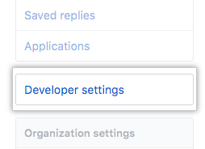
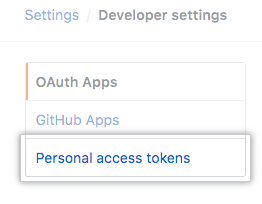
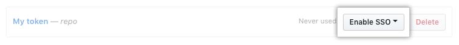
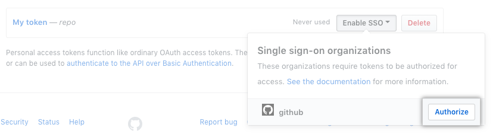

# Jeton d'accès Github

Pour utiliser un jeton d'accès personnel avec une organisation utilisant l'authentification unique SAML, vous devez d'abord autoriser le jeton.

Vous pouvez autoriser un jeton d'accès personnel existant ou créer un nouveau jeton d'accès personnel, puis l'autoriser.

1. Dans le coin supérieur droit de n'importe quelle page, cliquez sur la photo de votre profil, puis sur  **Settings**.  

   

2. Dans la barre latérale gauche, cliquez sur **Developer settings**.  

   

3. Dans la barre latérale gauche, cliquez sur **Personal access tokens**.  

   

4. A côté du jeton que vous souhaitez autoriser, cliquez sur  **Enable SSO**.  

   

5. Recherchez l'organisation pour laquelle vous souhaitez autoriser le jeton d'accès.
6. Cliquez sur  **Authorize**.  

   

 

